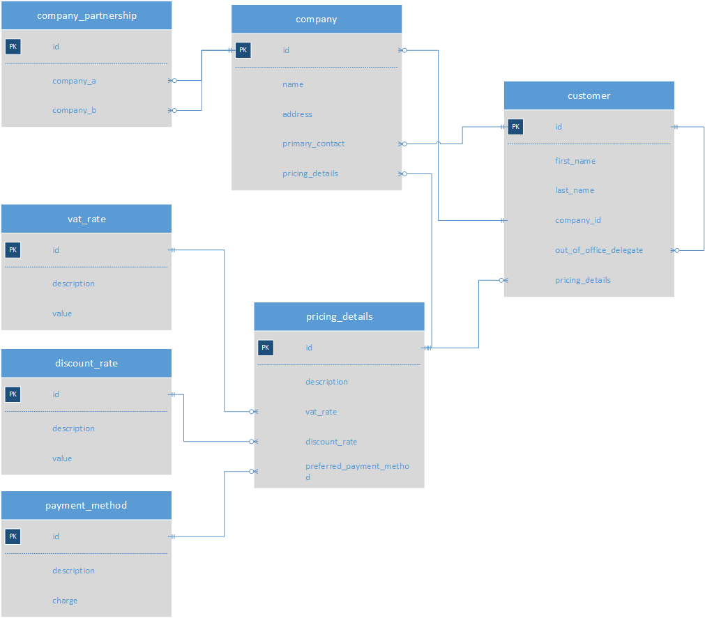

# GraphQL, Spring WebFlux, DataLoader, JOOQ

This is a sample GraphQL application written in Kotlin that uses 
[graphql-java](https://github.com/graphql-java/graphql-java) and Spring WebFlux (with Spring Boot 2), additionally using
[java-dataloader](https://github.com/graphql-java/java-dataloader) and [jOOQ](https://www.jooq.org/). This is forked
from https://github.com/geowarin/graphql-webflux, to show how support for DataLoader can be added, and to add some
custom functionality related to adding database joins based on requested GraphQL fields.

The application shows how a GraphQL endpoint can be exposed using Spring Boot WebFlux. GraphQL requests are handled in a
non-blocking way all the way down to the point of fetching the data from the database, using jOOQ. Since this last part
currently relies on JDBC (which is blocking), to prevent blocking the main threads, all database work is executed on a
thread from a dedicated thread pool. See
[here](https://blog.jooq.org/2014/09/23/asynchronous-sql-execution-with-jooq-and-java-8s-completablefuture/) for more
details on this.

As well as GraphQL, DataLoader is used to prevent the
[N+1 problem](https://medium.com/@gajus/using-dataloader-to-batch-requests-c345f4b23433).

And as explained further down, an enhancement to the default DataLoader functionality is also included, attempting to
solve (in a much more simplified and cut down way) what [Join Monster](https://join-monster.readthedocs.io/) does in
a JavaScript environment, namely adding joins to database queries based on what GraphQL fields are requested.

## Instructions
Load the project into your IDE (I'm using IntelliJ) and run the `GraphQLApplication` class. This will start a Spring Boot
application serving GraphQL requests.

Open `localhost:8080` in your browser. You will see the [GraphiQL](https://github.com/graphql/graphiql) explorer.
There you can start making GraphQL calls. The underlying H2 database is populated with test data at application
startup so you can immediately make a call such as:
```
{
  customers {
    id
    firstName
    lastName
    company {
      id
      name
      address
    }
  }
}
```

(Please note the [Pre-Requisites](#pre-requisites) section first.)

## Project Structure
This project is structured as follows:
* The *entry point* is a handler for HTTP requests to the `/graphql` endpoint. This is defined in the `GraphQLRoutes`
class. The handler delegates the handling of individual requests to one of the...
* *GraphQL resolvers*: These are defined in the `resolvers` package. In here the `Query` class has one method for each
query defined in the GraphQL schema (`/resources/schema.graphqls`). Each of these delegate the call onto one of the..
* *Services*: There is one service for each of the entities (AKA domain model objects) in the system. These are found in
the `services` package. Each of these make a call to a repository from the...
* *Data Access Layer*: This package contains all the repositories, responsible for fetching data from the underlying
database. These are all found in the `dataacess` package.

Once an entity has been returned from the service to the GraphQL components, it might be ready to return to the client.
However there are cases where the GraphQL schema describes an object as having a property (a GraphQL field) which
doesn't directly correlate to one of the properties on the entity: it might need to be fetched separately. For example,
say there is a Customer entity, with a related Company entity. And say that the Customer entity has a property called
companyId, which only exposes the ID of the company, not the whole Company object. The GraphQL schema might define that
its Customer type *does* have a property called "company", which returns a full Company object. In this case a GraphQL
resolver has to be created, which will *resolve* (i.e. provide a value for) those properties which don't exist on a
Customer entity. In this project, these resolvers are defined in the `resolvers` package, just like the main `Query`
resolver, even though conceptually they might seem to do different things. (As far as the GraphQL components are
concerned, both objects are still `GraphQLResolver` objects.)   

So, each of those of resolvers could, when requested, query for the supplied customer's related company. However, there
are two problems with this approach:
1. It would lead to the N+1 problem: if the user queried for N customers, each with a related company, the total number
of hits to the database would be N+1: one hit for the customers, and N hits for each of the customers' companies.
1. If two customers had the same company, there would still be two hits to the database, which is redundant.

The solution to the above is the mighty DataLoader: when the resolver is asked for a customer's company, instead of
querying the database for it, it returns a "promise" (in the form of a `CompletableFuture`) which, when needed, will
return the value. That "promise" is created by delegating the call to a `DataLoader`. That data loader is previously
set up, providing it with a function which takes in a set of "keys" (unique identifiers, in our example company IDs),
and returns the corresponding entities (companies). The caching, and handling of duplicates, is all done by the
DataLoader libraries. So at this point, the N+1 problem becomes a 1+1 non-problem :-) There is now one query for
customers, and one single query for all the returned customers' companies.

Which leads to the next main subsystem in this project...
* *Data loaders*: these are defined in the `dataloaders` package.

However, there is still an improvement that could be made: the above approach still makes two hits to the database.
And obviously as more data related to customers is requested, this will mean more hits to the database.
A more performant way of getting the data would be to make a single call to the database, joining the Customer and
Company tables. From each single returned row of data, both a Customer and a Company entity could be created. And this
where the next main subsystem comes in...

* *Joins* are handled in the `dataacess/joins` package. Here, database joins are defined, and mappings between GraphQL
fields and these joins are defined.

When a query containing some joins is executed, each row could result in multiple entities being created (e.g. customers
and companies in our example). These need to be cached in the data loaders so that when the GraphQL resolvers are called
they can use these pre-cached values. This is done via the `EntityCreationListener` interface.

One important point to note is that the joins which are included in the query are based on the requested GraphQL fields.
So if the client simply requests Customer objects, with no company information, then the Company table should not be
included in the query. Therefore the joins are added dynamically at runtime, based on the requested GraphQL fields.

## Sample Database
Below is an entity relationship diagram showing the database tables in this example. (This is a completely contrived
and unrealistic example - apologies!).

As can be seen, there is a "customer" table, and each customer has a related "company". In
order to test some of more complex scenarios (like joining a table to itself, and needing to alias tables when two
instances of the same table are included in a query), each customer can have an "out of office delegate", which is
simply a reference to another customer record.

Companies have a "primary_contact" (a reference to a customer record), so that circular relationships can be
tested (e.g. a customer pointing to a company pointing to a customer...).

The "pricing_details" table contains records which have references to "vat_rate", "discount_rate", and "payment_method"
records. This is for an example of an entity (PricingDetails) whose data comes from multiple tables rather than just one
table. Companies and Customers both have a reference to the "pricing_details" table.

Finally, there is a "company_partnership" table, which just contains a reference to two companies, which again is an
example of an entity whose data is based on two tables, this time where this involves joining the same table twice
(once for each of the companies in the partnership). 



## Pre-Requisites
Some settings in some of the files (e.g. gradle.properties and build.gradle) mean that as things currently stand
the code will only work on Java 10 (and possibly 9: I haven't tried), but not on Java 8.  This is because of the
changes to how JAXB was bundled up since Java 9.  This is discussed [here](https://github.com/jOOQ/jOOQ/issues/6477)
and [here](https://github.com/etiennestuder/gradle-jooq-plugin/issues/55).
However to get it working in Java 8 should be possible by removing the calls to `--add-modules` in the two files
mentioned, and possibly some other tweaking.

## Current Status
* DataLoader added.
* JOOQ added.
* Example data structure created (customers, companies)
* H2 data access implemented
* Data loaded by services, and from GraphQL resolvers, primed into data loaders to avoid redundant re-fetching in subsequent resolvers.
* Joins added (i.e. joins automatically added based on requested GraphQL fields)
* Repositories based on multiple tables now supported.
* Entities and GraphQL fields whose data is based on multiple tables supported in join-handling solution.

## To Do
* Investigate the possibility of using a non-blocking database driver (e.g. for Postgres) to provide truly non-blocking
data access.
* Currently this only works with one-to-one and many-to-one joins: one-to-many joins change the number of returned
records, and things get even more complicated when multiple one-to-many joins are included, so need to think about
whether this is desirable. Possibly compare with what [Join Monster](https://github.com/acarl005/join-monster) does.
* Add mutations.
* Unit tests.
* Test error handling (esp in async code).
* Implement all TODOs in the code.
* Separate into modules?  Separate framework from example implementation?